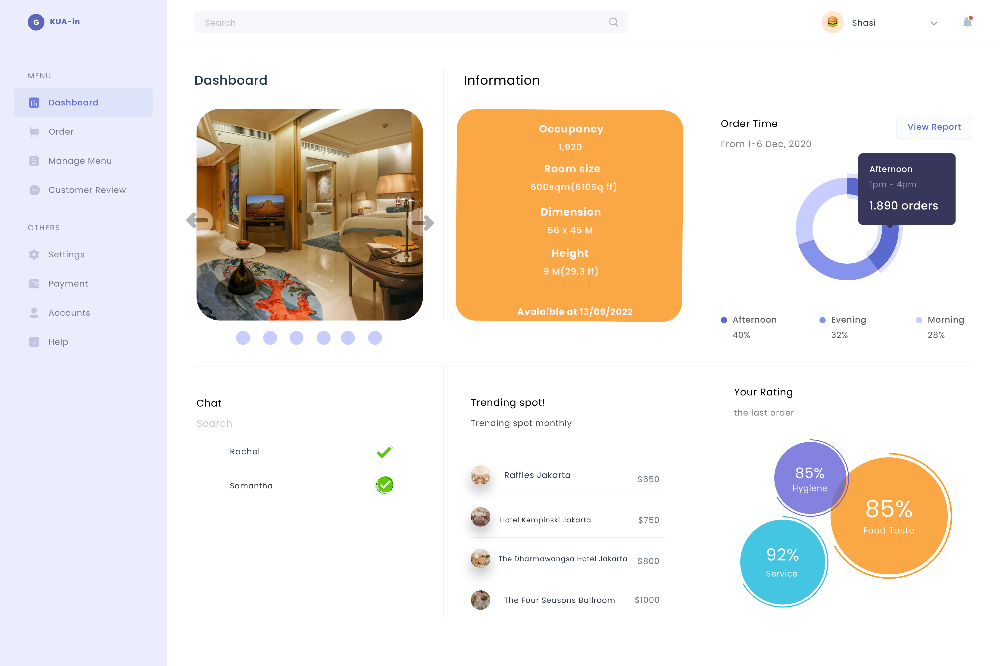

# Interinships Portfolio

#### Technical Skills Advance level: Python, SQL, C, Amibroker Formula Languange
#### Technical Skills Novice Level: C, Html, CSS, Php, Java

## Education
- Computer Science | The University of Bina Nusantara (2021 - Present, third year)								       		

## Work Experience
**Freelance Cashier (_May 2020 - October 2021)**
- Handling customer queries, complaints, or refunds.

**Co-Founder @ Bot Mbah Gondrong (_July 2021 - May 2022)**
- Manage the database and maintain the database almost every day.
- Make sales until it generates a net profit of about 70% of the total net profit earned in a period of less than a year.
- Create a design for visualization of the coding that has been formed and create a formula for forecasting and screening.

**Freelance Teaching (_August 2021 - Oct 2021)**
- The ways to measure and improve bot performance and user experience.

## Projects

### Amibroker Chart With Techinal Analysis

Automate and maximize strategies for analyzing and screening subjective financial data instruments using artificial algorithms and visualized in chart form.

### UIUX Home Page
[Figma Link](https://www.figma.com/proto/kslZoY4hypqArBOpFRAvNN/Simple-homepage?node-id=1-2&starting-point-node-id=1%3A2&mode=design&t=fOMwxdmp4T6yjYjv-1)

My first project created **UIUX** for the homepage and was able to visualize the web flow by prototyping in Figma.

### Binder UIUX

[Figma Link](([https://www.figma.com/proto/kslZoY4hypqArBOpFRAvNN/Simple-homepage?node-id=1-2&starting-point-node-id=1%3A2&mode=design&t=fOMwxdmp4T6yjYjv-1)](https://www.figma.com/proto/71gMPgQnAHpAgVzv4hzFdY/Page-FAQ?node-id=102-4&starting-point-node-id=15%3A2&mode=design&t=RFTsEs1wI5xakBPX-1))

Create **UIUX** to visualize the web flow that will be created for the Binder web. This is my second semester project for subject Human Computer Interaction.

### Mobile Travel Prototype 

[Figma Link](https://www.figma.com/proto/tl4WtqdLwmX8izHZ1dHS3q/UAS-HCI?node-id=32-370&starting-point-node-id=4%3A219&mode=design&t=qB271JyLwcC3EFbx-1)

I designed multiple frames to showcase the app's key sections like the homepage, search bar, booking details, and mini games. Additionally, I integrated design elements, including colors, typography, icons, and images, that align with the app's concept and identity. The prototype is also capable of interacting with the user seamlessly, providing a clear and intuitive user flow.

### Mobile Travel Prototype 

[Figma Link]([https://www.figma.com/proto/tl4WtqdLwmX8izHZ1dHS3q/UAS-HCI?node-id=32-370&starting-point-node-id=4%3A219&mode=design&t=qB271JyLwcC3EFbx-1](https://www.figma.com/file/UTKuTL48Ciuj6NbgN8F0KW/Untitled?type=design&node-id=0%3A1&mode=design&t=LC15sN7LOuOeZJdF-1)https://www.figma.com/file/UTKuTL48Ciuj6NbgN8F0KW/Untitled?type=design&node-id=0%3A1&mode=design&t=LC15sN7LOuOeZJdF-1)

In the project that I led, my team and I created a UI/UX prototype for the web using Figma. Additionally, we developed a website with identical functions and interactions as the Figma prototype.

### Simple Dashboard Layout One-Page

