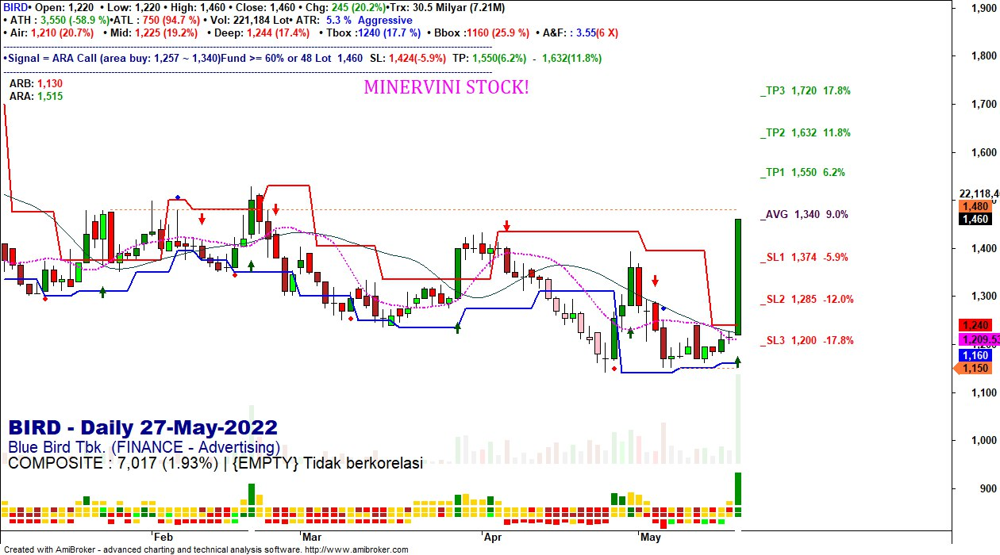
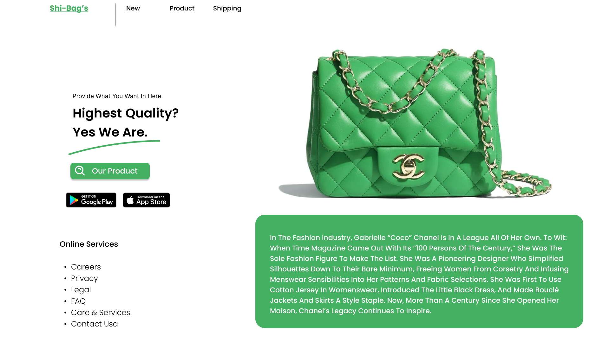
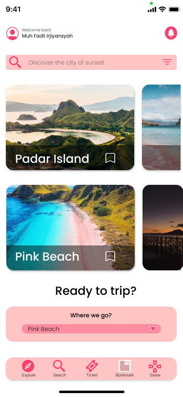
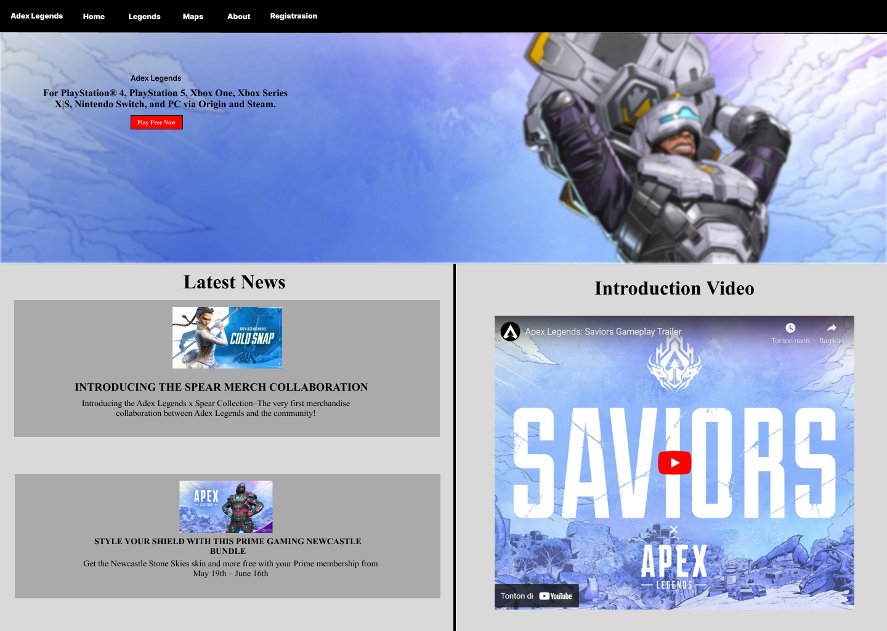
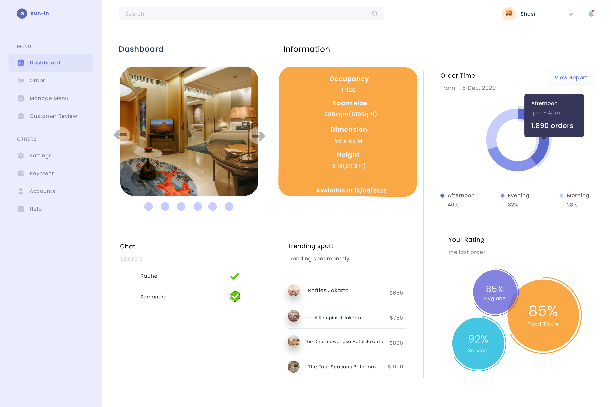

# Internship Portfolio

#### Technical Skills
- Advance level: Python, SQL, C, Amibroker Formula Languange
- Novice level: C, HTML, CSS, PHP, Java

## Education
- Computer Science | University of Bina Nusantara (_2021 - Present, third year_)
- Relevant courseworks: Database Design, Big Data Processing, Algorithm Design and Analysis, Database Technology, Data Structures, Linear Algebra, Basic Statistics               		

## Work Experiences
**Cashier - Freelance (_May 2020 - October 2021_)**
- Managed 99% cash transactions accurately and efficiently, ensuring a balanced cash drawer at the end of each shift.
- Provided excellent customer service by greeting and assisting customers in a friendly and professional manner.
- Resolved 10+ daily customer inquiries and concerns promptly, maintaining a positive and helpful attitude.
- Assisted in managing inventory levels by monitoring product availability and notifying management of low stock situations.
- Maintained accurate records of daily transactions and provided detailed reports to management.

**Mbah Gondrong Stocks - Co-Founder (_July 2021 - May 2022_)**
- Handle daily database management tasks and ensure the database's regular maintenance.
- Drive sales initiatives to contribute to a net profit equivalent to approximately 70% of the total net profit within a year.
- Develop a visual design for the coded elements and establish formulas for both forecasting and screening.

**Instructor - Freelance (_August 2021 - Oct 2021_)**
- Instructed customers in the effective utilization of a stock screening bot, conducting sessions at least 4 times a week.
- Created a learning guide in PDF format, providing customers with a valuable resource for self learning and stock analysis.
- Gathered customer feedback to identify areas of improvement in the curriculum and learning materials.

## Projects

### Amibroker Chart With Technical Analysis

Automated and maximized strategies for analyzing and screening subjective financial data instruments using artificial algorithms and visualized in chart form.

### UI/UX Homepage
[Figma Link](https://www.figma.com/proto/kslZoY4hypqArBOpFRAvNN/Simple-homepage?node-id=1-2&starting-point-node-id=1%3A2&mode=design&t=fOMwxdmp4T6yjYjv-1)

My first project created **UI/UX** for the homepage and was able to visualize the web flow by prototyping in Figma.

### Binder UIUX

[Figma Link](https://www.figma.com/proto/71gMPgQnAHpAgVzv4hzFdY/Page-FAQ?node-id=102-4&starting-point-node-id=15%3A2&mode=design&t=v91RYhAhZzfDGqcA-1)

Created **UI/UX** to visualize the web flow for Binder web. This was my second semester project for Human Computer Interaction subject.

### Mobile Travel Prototype 

[Figma Link](https://www.figma.com/proto/tl4WtqdLwmX8izHZ1dHS3q/UAS-HCI?node-id=4-219&starting-point-node-id=4%3A219&t=9nCNdbcODnqatxSI-1)

Designed multiple frames to showcase the app's key sections like the homepage, search bar, booking details, and mini games. Additionally, I also integrated design elements, including colors, typography, icons, and images that align with the app's concept and identity. The prototype is also capable of interacting with the user seamlessly, providing a clear and intuitive user flow.

### Adex Legend Web (Parody Apex Legends Web)

[Figma Link](https://www.figma.com/proto/UTKuTL48Ciuj6NbgN8F0KW/Untitled?node-id=2-152&starting-point-node-id=2%3A152&mode=design&t=PsOabqenxW6Tkc7S-1)

In the project that I led, my team and I created a UI/UX prototype for the web using Figma. Additionally, we developed a website using HTML and CSS only with identical functions and interactions as the Figma prototype.

### Simple Dashboard Layout One-Page
[Figma Link](https://www.figma.com/proto/wAKDR0EneqmzBIpf1zzGRc/Dashboard-(Community)?node-id=0-61&mode=design&t=ZGyeKGas9HaUeQ1o-1)

Simple project dashboard layout.

